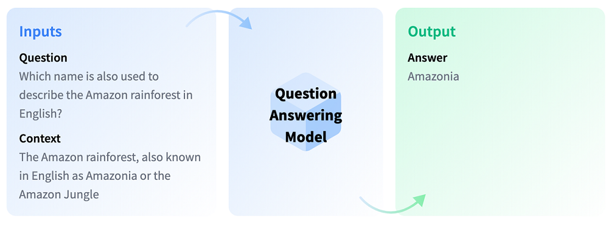
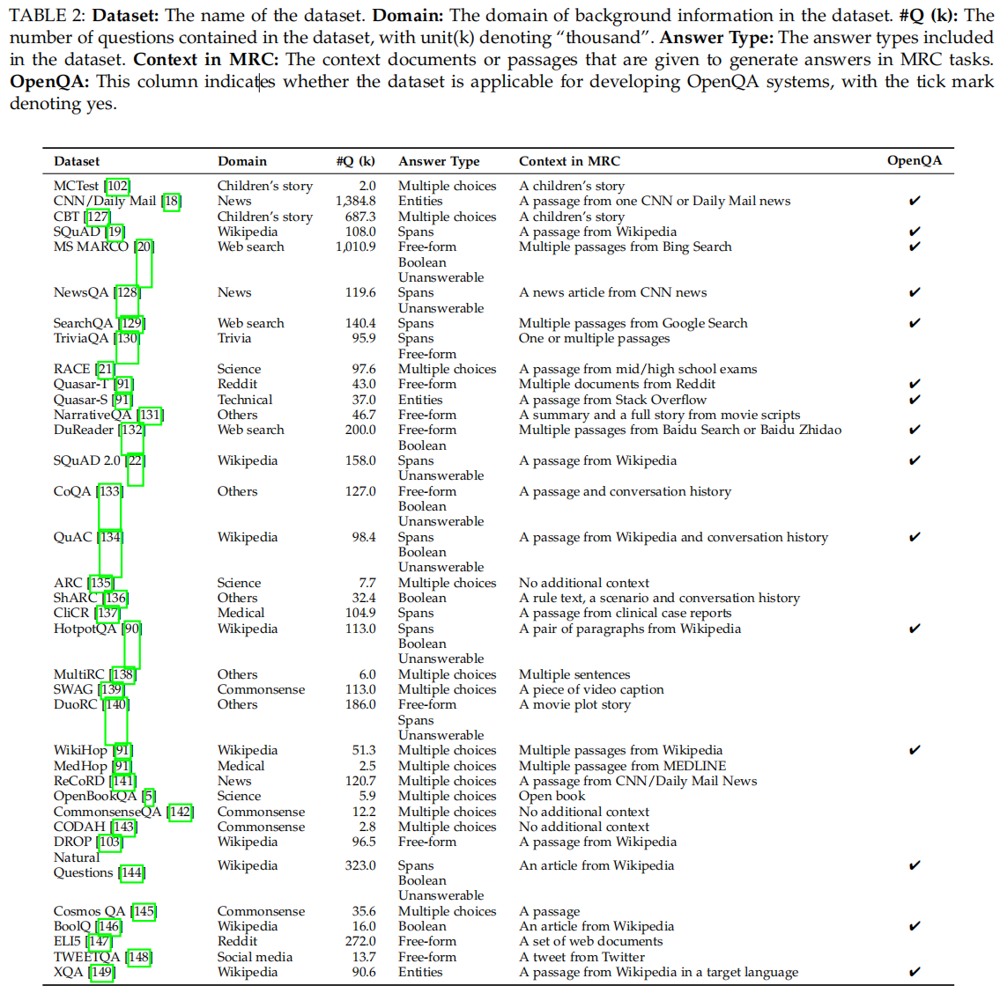
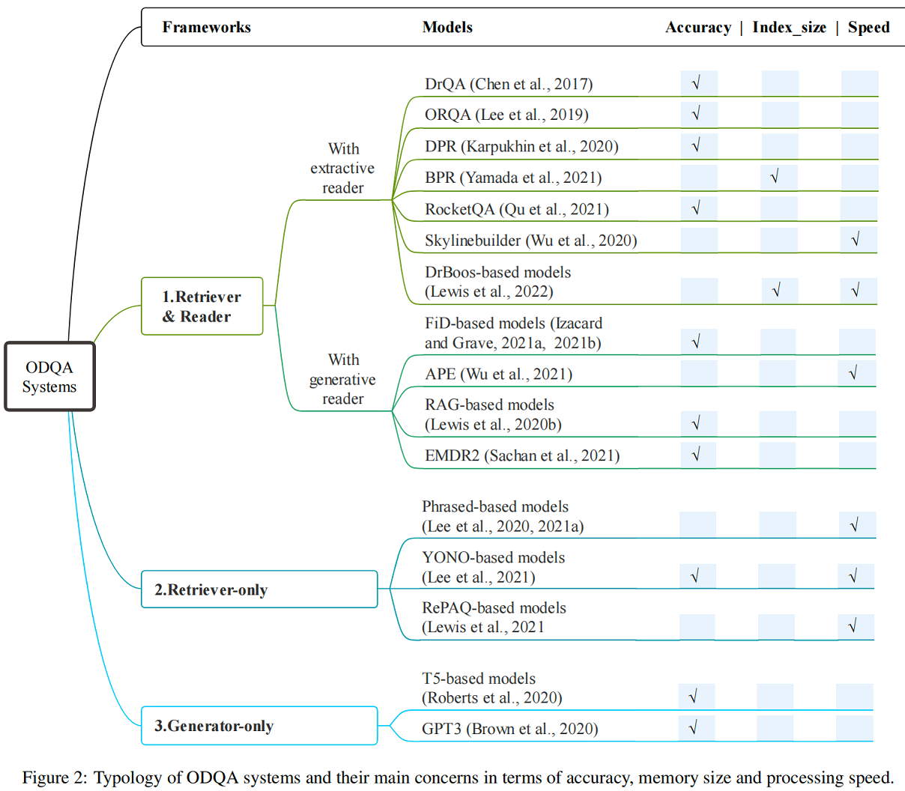
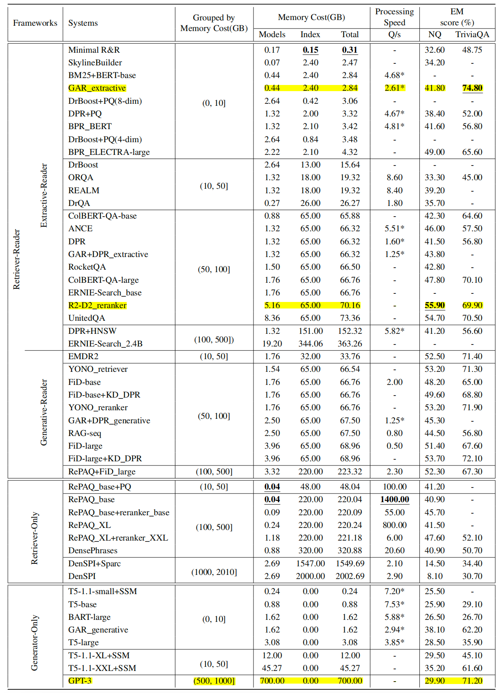

# 问答

问答（Question Answering）是一个经典的NLP任务。给定一个问题（question）和一段上下文（context），输出question对应的答案（answer），示例如下图所示。

需注意的是，这里的context是可选的。如果context缺失，答案一般来自于维基百科。

---

#### 2018-12-20 dump of wikipedia corpus

(Karpukhin et al., 2020)提出的数据，包含21 million 100-word-long passages，这是最常用的数据。其索引文件的大小达到了65GB；

#### 2016-12-21 dump of English Wikipedia

包含5.1 million articles，索引文件达到了26GB；

contest: Efficient QA

## 主流比赛

EfficientQA

DuReader是百度举办的中文阅读理解比赛。

## 数据集

## 度量方法metric

### 性能度量方法

- latency
- indexing time
- query time
- reasoning time
- questions per second

### 成绩度量方法

- EM(Exact Match): 完全匹配到任何一个参考答案的比例；
- F1-score
- MRR@k: 最相关文章被检索到的平均排行；
- Precision@k
- Recall@k
- retrieval acc@k

## 主流方法

QA的主要方法有三种，分别是retriever-reader、retriever-only和generator-only.

### retriever-reader

retriever-reader将问答分成两阶段：首先由retriever从包含众多文档的语料库中检索出最相关的文档，然后由reader基于这些遴选出来的文档（也称evidence）生成最终答案。具体生成答案的方式有两种，一种是抽取式，即预测答案的start index和end index；另一种是生成式，基于自回归来生成答案文本。代表工作有：

- (Chen et al., 2017)提出的DrQA是开山之作；
- (Karpukhin et al., 2020)提出DPR(Dense passage retriever)
- (Qu et al,. 2021)提出RocketQA
- (Ren et al,. 2021)提出RocketQA-v2

retriever-reader的优点是成绩好，缺点是推理时间长，一般需要庞大的索引和较慢的处理速度；

### retriever-only

一类方法是直接将长文档切割成phrase然后将最相关的phrase作为答案输出；另一类是将语料库处理成QA pair，然后基于QQP在QA pair数据中检索出和当前question最相似的问题，并将其对应的回答作为答案输出；

### generator-only

直接在维基百科或者知识语料上训练生成模型，从而将语料知识存储到生成模型的参数中，最终基于生成来输出答案。

当前基于生成的方法效果不是很好，并且生成的结果不可控。另外，考虑到知识的时效性，知识的不断更新意味着模型也需要迭代训练，由此带来较大的成本。

## 综述

(Zhu et al., 2021)

(Guo et al., 2021)

(Etezadi and Shamsfard 2022)

## 参考文献

#### 综述

- 
- Retrieving and Reading: A Comprehensive Survey on Open-domain Question Answering

|ref|paper|model|comment|link|
|--|--|--|--|--|
||||||
|(Yu et al,. 2023)|Unified Language Representation for Question Answering over Text, Tables, and Images||多模态|https://arxiv.org/pdf/2306.16762.pdf|
|(Zhang et al., 2023)|A Survey for Efficient Open Domain Question Answering||综述，侧重高效|https://arxiv.org/pdf/2211.07886.pdf|
|(Dai et al,. 2023)|Long-Tailed Question Answering in an Open World|||https://arxiv.org/pdf/2305.06557.pdf|
|(Cheng et al., 2023)|Task-Aware Specialization for Efficient and Robust Dense Retrieval for Open-Domain Question Answering|TASER||https://aclanthology.org/2023.acl-short.159.pdf|
|(Qin et al., 2023)|WEBCPM: Interactive Web Search for Chinese Long-form Question Answering||数据集|https://aclanthology.org/2023.acl-long.499.pdf|
|(Li et al., 2023)|Self-Prompting Large Language Models for Zero-Shot Open-Domain QA|||https://arxiv.org/pdf/2212.08635.pdf|
|(Zhong et al,. 2022)|ProQA: Structural Prompt-based Pre-training for Unified Question Answering|ProQA||https://aclanthology.org/2022.naacl-main.313.pdf|
|(Asai et al., 2022)|Evidentiality-guided Generation for Knowledge-Intensive NLP Tasks|EviGen||https://arxiv.org/pdf/2112.08688.pdf|
|(Mao et al., 2021)|Generation-Augmented Retrieval for Open-Domain Question Answering||GAR_generative实现了38.10%的EM|https://aclanthology.org/2021.acl-long.316.pdf|
|(Fajcik et al., 2021)|R2-D2: A Modular Baseline for Open-Domain Question Answering|||https://aclanthology.org/2021.findings-emnlp.73.pdf|
|(Singh et al., 2021)|End-to-End Training of Multi-Document Reader and Retriever for Open-Domain Question Answering|EMDR2|generate-only，采用互监督(mutual supervision)然后再dual-encoder retriever和t5-based generator上采用端到端训练；|https://arxiv.org/pdf/2106.05346.pdf|
|(Lewis et al., 2021)|Retrieval-Augmented Generation for Knowledge-Intensive NLP Tasks|RAG||https://arxiv.org/pdf/2005.11401.pdf https://github.com/facebookresearch/DPR|
|(Izacard and Grave, 2021)|Leveraging Passage Retrieval with Generative Models for Open Domain Question Answering|FiD|基于BM25或者DPR来检索evidence，然后输出T5来生成最终答案|https://aclanthology.org/2021.eacl-main.74.pdf|
|(Karpukhin et al., 2020)|Dense Passage Retrieval for Open-Domain Question Answering|**DPR**|基于BERT构造dual-encoder retriever，然后通过对比学习和负采样策略来训练retriever，成为QA中比较优秀的baseline|https://aclanthology.org/2020.emnlp-main.550.pdf|